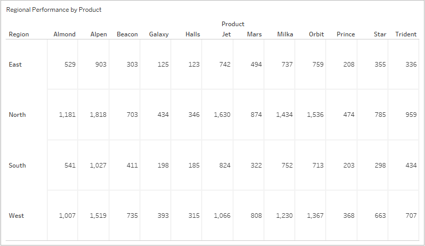
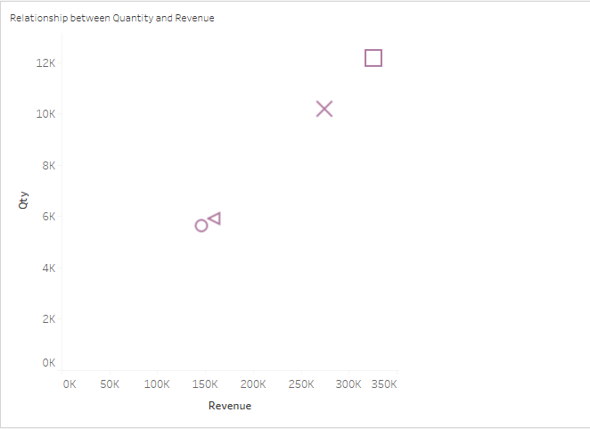
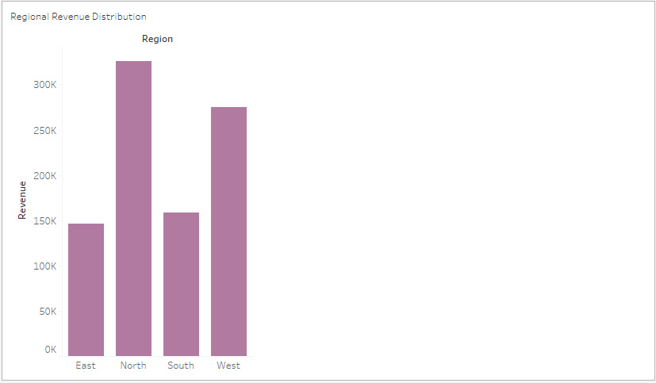
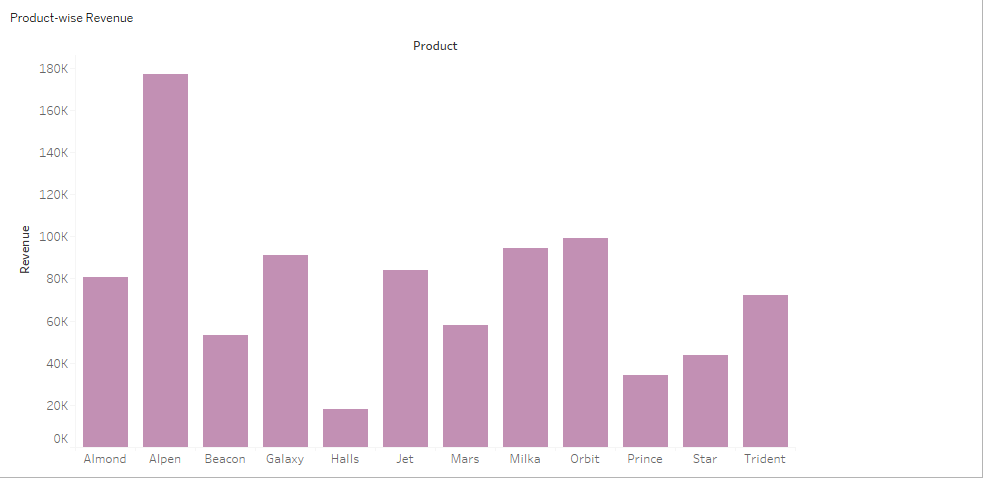
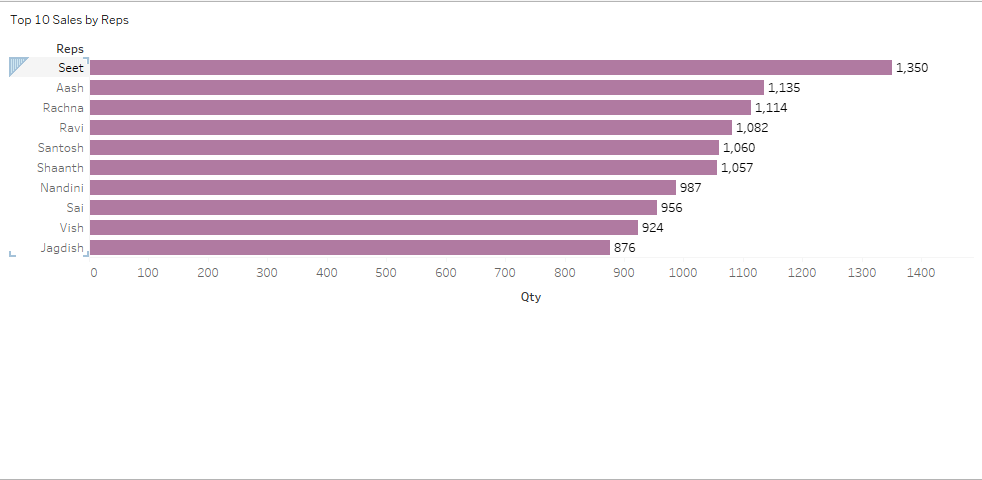

# Sales Analysis README

## **Introduction**
This analysis explores sales performance data collected from various regions, products, and sales representatives. The visualizations aim to provide actionable insights for improving sales strategies and optimizing revenue generation.

The dataset contains the following columns:
- **Reps**: Sales representatives' names
- **Product**: Products sold
- **Qty**: Quantity sold
- **Revenue**: Revenue generated from sales
- **Region**: The region of sales

## **Visualizations and Insights**

### **1. Regional Performance by Products**

**Description**: This chart illustrates the contribution of each product to the total revenue in different regions (North, South, East, and West).

****

**Insights**:
- The **West region** consistently generates the highest revenue, particularly from products like Galaxy and Alpen.
- The **East region** has the lowest contribution across all products.

**Recommendations**:
- Focus on increasing sales in the East region by promoting popular products (e.g., Galaxy and Alpen) with targeted marketing campaigns.
- Strengthen inventory management in the West region to maintain its performance.

---

### **2. Relationship Between Quantity and Revenue**

**Description**: This plot highlights how the quantity sold correlates with revenue across products and sales reps.

****

**Insights**:
- A higher quantity sold often correlates with higher revenue, but the relationship varies by product.
- Outliers like Bala's 24 units of Star stand out for generating significant revenue.

**Recommendations**:
- Incentivize sales reps to focus on high-revenue products by setting sales goals for specific items.
- Identify outliers and replicate their strategies across other regions or products.

---

### **3. Regional Revenue Distribution**

**Description**: This chart visualizes the percentage contribution of each region to the total revenue.

****

**Insights**:
- The **West region** accounts for the largest share of revenue (~40%).
- The **South and East regions** contribute the least to total revenue.

**Recommendations**:
- Reassess sales efforts in the South and East regions to identify areas for growth.
- Focus resources in the North and West regions, where sales strategies are already effective.

---

### **4. Product-Wise Revenue**

**Description**: This chart ranks products based on their revenue contributions.

****

**Insights**:
- **Star and Galaxy** are the top-performing products, generating the highest revenue.
- Products like **Halls and Trident** have significantly lower sales performance.

**Recommendations**:
- Prioritize marketing and inventory for Star and Galaxy to maximize returns.
- Evaluate the underperformance of Halls and Trident and consider promotions or replacements.

---

### **5. Top 10 Sales Reps**

**Description**: This chart lists the top 10 sales reps based on revenue generated.

****

**Insights**:
- **Bala, Rachna, and Ananya** are the highest contributors.
- The top 3 reps alone account for a significant portion of the total revenue.

**Recommendations**:
- Recognize and reward top performers to sustain motivation and productivity.
- Train underperforming reps using strategies employed by the top reps.

---

### **6. KPI Card: Total Revenue**
**Metric**: $905,702

**Description**: This KPI card highlights the total revenue generated across all regions and products.

**[View Dashboard](https://public.tableau.com/app/profile/oliseh.okiah/viz/SalesAnalysis_17337698482380/Dashboard1)**

**Insights**:
- Revenue is heavily skewed towards specific regions and products.

**Recommendations**:
- Set quarterly revenue targets to align with organizational goals.
- Optimize product mix to balance revenue across the board.

---

### **7. KPI Card: Total Quantity**
**Metric**: 245 Units

**Description**: This KPI card displays the total quantity of products sold.

**[View Dashboard](https://public.tableau.com/app/profile/oliseh.okiah/viz/SalesAnalysis_17337698482380/Dashboard1)**

**Insights**:
- Higher quantities are concentrated in fewer products (e.g., Star and Alpen).

**Recommendations**:
- Focus on diversifying product sales to increase total units sold across more product categories.

---

## **Concluding Remarks**
This sales analysis provides a clear picture of regional and product-level performance, offering insights into where efforts should be concentrated to maximize revenue and growth. Further steps include:
- Implementing targeted marketing strategies for underperforming regions.
- Rewarding and training sales reps based on their performance.
- Optimizing inventory to meet regional demands efficiently.

For further exploration, consider additional metrics like customer demographics or seasonal trends to refine insights further.
